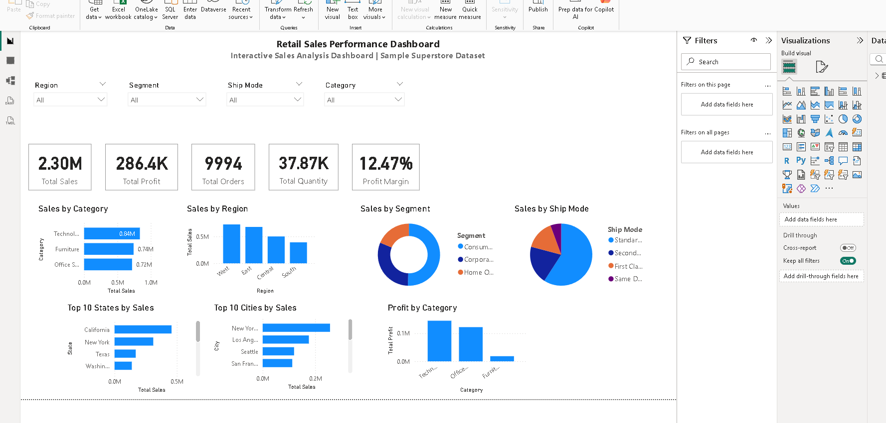

# Business Intelligence Dashboard for Retail Sales

## Project Overview

This project is an interactive Power BI dashboard built using the Sample Superstore dataset. The dashboard helps analyze retail sales performance by providing key business insights through KPIs, charts, and slicers.

## Dashboard Features

- Total Sales KPI
- Total Profit KPI
- Total Orders KPI
- Total Quantity KPI
- Profit Margin KPI
- Sales by Category
- Sales by Region
- Sales by Segment
- Sales by Ship Mode
- Top 10 States by Sales
- Top 10 Cities by Sales
- Profit by Category

## Interactive Filters

- Region
- Segment
- Ship Mode
- Category

## Tools & Technologies

- Power BI Desktop
- Power Query
- DAX
- Data Modeling
- Data Visualization

## Dataset

Sample Superstore Dataset

## Key Insights

- Technology category generated the highest sales.
- West region achieved the highest sales.
- Standard Class was the most used shipping mode.
- Sales performance can be analyzed dynamically using slicers.

## Files Included

- Retail_Sales_Dashboard.pbix
- SampleSuperstore.csv
- Dashboard.png
- README.md

## Dashboard Preview

## Business Insights

- Technology generated the highest sales among all product categories.
- The West region recorded the highest overall sales.
- Standard Class was the most frequently used shipping mode.
- Interactive slicers enable dynamic analysis by Region, Segment, Category, and Ship Mode.
- Profit Margin KPI helps evaluate overall business profitability.

## Author

**Neeru Neeru**

Aspiring Data Analyst | SQL | Python | Power BI | Machine Learning

🔗 GitHub: [NeeruSisodia](https://github.com/NeeruSisodia)

🔗 LinkedIn: [Neeru Neeru](https://www.linkedin.com/in/neeru-neeru-821857320/)
